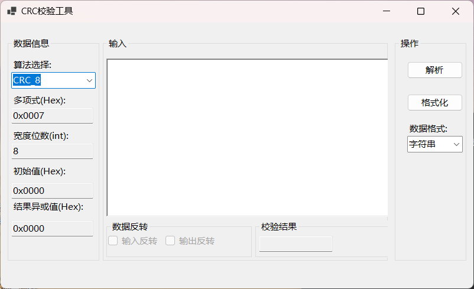
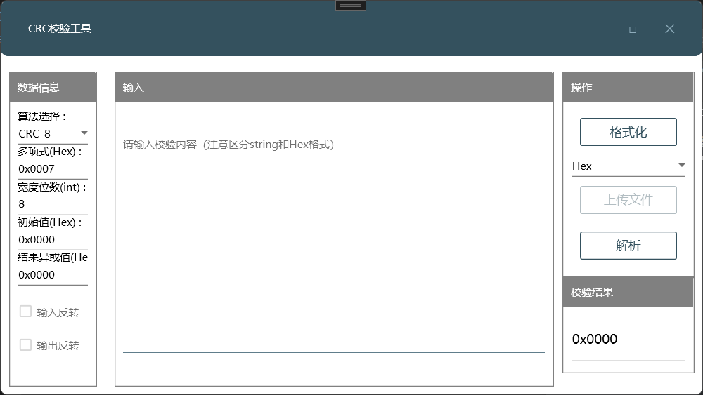

# CRCVerifyTool

可校验字符串（默认UTF-8)格式，Hex格式，文件）


### winform版本



### wpf版本

使用MaterialDesign样式库 ，简单程序没有上开发框架




## 安装程序

安装包在两个文件夹内

```
CRCVerifyTool_Winform版
	Release
		setup.exe
		CRCVerifyTool_Winform版.msi
CRCVerifyTool_WPF版
	Release
		setup.exe
		CRCVerifyTool_WPF版.msi
```

